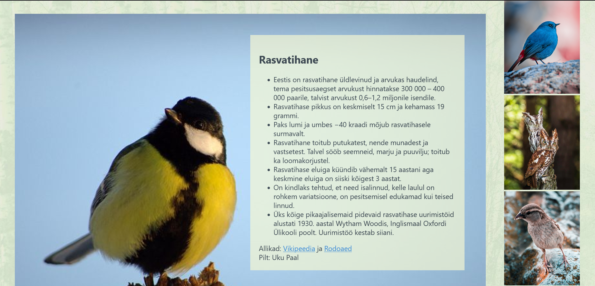

# Linnu Leht

There are many a bird in the world and some of them reside in Estonia. Well, at least part-time. And we are happy to host the party! We are also happy to have made a [webpage](https://kodu.ut.ee/~susi1417/LinnuLeht/views/index.html) about five of our favourite birdies and we want to share..  
..both with you guys that are just browsing github..  
..and with our lecturers who gave us the opportunity to create something:)  
Can we get a round of applause for our lecturers who may or may not be grading us? Those guys are great! Really great! Just great!

### Table of Contents

* [Technologies Used](#technologies-used)
* [Features](#features)
* [Setup](#setup)
* [Project Status](#project-status)

### Technologies Used

- HTML  
- CSS  
- JavaScript  

### Features

- Look at nice photos of birds.  
- Read interesting information about birds.  
- Test your skills in recognising birds.
- Birds.  

### Setup

You might have guessed that you need a browser to view our page.  
Since you are reading this helpful section you probably already have one, so you are all set.  
We tested the page in Firefox, Chrome, and Brave and it seems to work. Nothing else is guaranteed. 

### Project Status

Project is complete and there will be no further developments. It is perfect the way it is - just like you^^.
