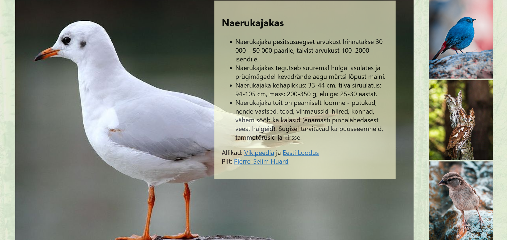

# Linnu Leht

Have a look at the [awesome webpage](LINK)  we made.

### Table of Contents

* [General Info](#general-information)
* [Technologies Used](#technologies-used)
* [Features](#features)
* [Setup](#setup)
* [Project Status](#project-status)

### General Information

- Provide general information about your project here.
- What problem does it (intend to) solve?
- What is the purpose of your project?
- Why did you undertake it?

### Technologies Used

- Tech 1 - version 1.0
- Tech 2 - version 2.0
- Tech 3 - version 3.0

### Features

List the ready features here:
- Awesome feature 1
- Awesome feature 2
- Awesome feature 3

### Setup

What are the project requirements/dependencies? Where are they listed? A requirements.txt or a Pipfile.lock file perhaps? Where is it located?

Proceed to describe how to install / setup one's local environment / get started with the project.

### Project Status

Project is: _in progress_ / _complete_ / _no longer being worked on_. If you are no longer working on it, provide reasons why.
